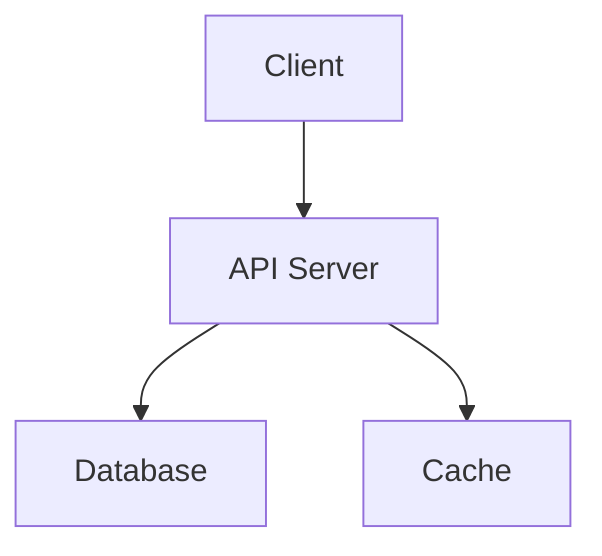

## using tabs

- that the `const fuck = 69`

<ScriptCopyBtn
  commandMap={{
    npm: "npm run shadcn add button",
    yarn: "yarn shadcn add button",
    pnpm: "pnpm dlx shadcn@latest add button",
    bun: "bun x shadcn@latest add button",
  }}
/>

## code comparison

<CodeComparison
  beforeCode={`
    team = await getTeamBySlug(slug); // [!code highlight]
  `}
  afterCode={`
    import { createMiddleware, type MiddlewareFunctionProps } from '@app/(auth)/auth/_middleware';
    import { team } from '@/app/(team)/team/_middleware';

    const middlewares = {
    '/auth{/:path?}': auth,
    '/team{/:slug?}': [ auth, team ],
    };

    export const middleware = createMiddleware(middlewares); // [!code focus]

    export const config = {
      matcher: ['/((?!_next/|_static|_vercel|[\\w-]+\\.\\w+).*)'],
    };

`}
language='typescript'
filename='middleware.ts'
/>

## code highline

```tsx
import {
  createMiddleware, // [!code highlight]
  type MiddlewareFunctionProps,
} from "@app/(auth)/auth/_middleware";
import { auth } from "@/app/(auth)/auth/_middleware"; // [!code --]
import { auth } from "@/app/(auth)/auth/_middleware"; // [!code ++]
import { team } from "@/app/(team)/team/_middleware";

const middlewares = {
  "/auth{/:path?}": auth,
  "/team{/:slug?}": [auth, team],
};

export const middleware = createMiddleware(middlewares); // [!code focus]

export const config = {
  matcher: ["/((?!_next/|_static|_vercel|[\\w-]+\\.\\w+).*)"],
};
```

or

```tsx title="config.ts" {1,2}#v {9,10}#s
import { useCopyToClipboard } from "@/hooks/use-copy-to-clipboard";
import { Button } from "@/components/ui/button";

export function Component() {
  const [copy, isCopied] = useCopyToClipboard();

  return (
    <Button
      onClick={() =>
        copy("hello world").then(() => console.info("Text copied!"))
      }
    >
      {isCopied ? "Text Copied" : "Click to copy"}
    </Button>
  );
}
```

```js /age/#v /name/#v /setAge/#s /setName/#s /50/#i /"Taylor"/#i
const [age, setAge] = useState(50);
const [name, setName] = useState("Taylor");
```

## Mermaid diagram:



## twoslash

```js twoslash
const name = "Jupiter";
console.log("Hello, " + name + "!");
```

## images


## math - latex

The quadratic formula is $x = \frac{-b \pm \sqrt{b^2 - 4ac}}{2a}$

And here's a block equation:

$$
\int_{a}^{b} f(x) \, dx = F(b) - F(a)
$$
