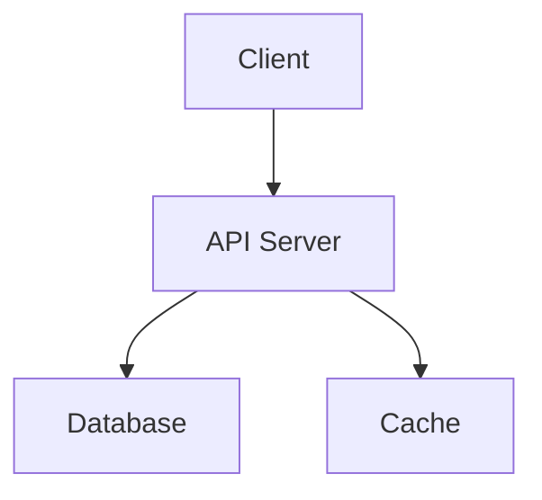

## using tabs

- that the `const fuck = 69`

<Tabs defaultValue="pnpm">
 <TabsList>
  {["npm", "yarn", "pnpm"].map((key) => {
    return (
      <TabsTrigger
        key={key}
        value={key}
      >
        {key}
      </TabsTrigger>
    );
  })}
</TabsList>

{Object.entries({
npm: "npm install shit",
yarn: "yarn install shit",
pnpm: "pnpm install shit",
}).map(([key, value]) => {
return (

<TabsContent key={key} value={key} className='mt-0'>
  <pre className='overflow-x-auto px-4 py-5'>
    <code
      className='relative font-mono text-sm leading-none'
      data-language='bash'
    >
      {value}
    </code>
  </pre>
</TabsContent>
); })}

</Tabs>

## code highline

```tsx title="config.ts" {1,2}#v {9,10}#s
import { useCopyToClipboard } from "@/hooks/use-copy-to-clipboard";
import { Button } from "@/components/ui/button";

export function Component() {
  const [copy, isCopied] = useCopyToClipboard();

  return (
    <Button
      onClick={() =>
        copy("hello world").then(() => console.info("Text copied!"))
      }
    >
      {isCopied ? "Text Copied" : "Click to copy"}
    </Button>
  );
}
```

```js /age/#v /name/#v /setAge/#s /setName/#s /50/#i /"Taylor"/#i
const [age, setAge] = useState(50);
const [name, setName] = useState("Taylor");
```

## Mermaid diagram:



## twoslash

```js twoslash
const name = "Jupiter";
console.log("Hello, " + name + "!");
```

## images


